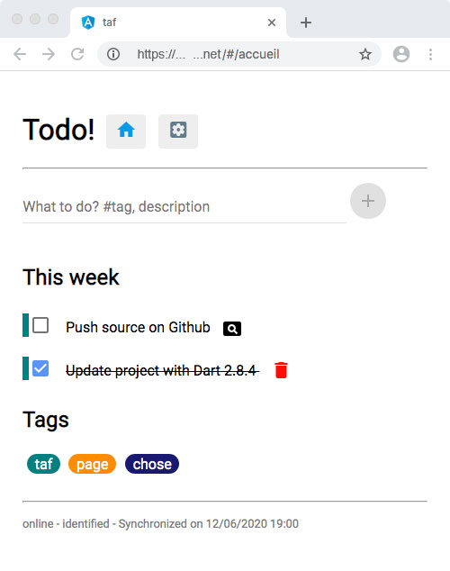

# taf
Taf project is a todo list in a single page Angular Dart web application working inline/offline and synchronized with a server.

This application is under construction. However, the current version is functionable, even if not totaly stabilized. The source code is shared as a study case for developing PWA web application with Dart.

## Build
To build the projet, first install Dart SDK : <https://dart.dev/get-dart>. Then, download the project_code folder from this repository. Within this folder, run in command line : 
```
pub get
pub global run webdev build --output=web:build
```
You will get the build folder with the functionable code. 

## Deploy
The build folder is supposed to be hosted on a LAMP server. Upload the content of build folder on your server. Before starting the app, next step is installing the database.

### Server side environment
Before going on, there is some work to setup the server side environment. The todo list storage is located twice, first with local storage (on a mobile device) and second inside a server database. This remote storage make the list available everywhere. The server side source code is with PHP and MySQL language. To make it work for your need, you have to prepare the database and to customize some files. A tiny MariaDB NoSQL database is sufficient.

Go to `http://...yourhostingurl.ext/api/server/databaseCreation.php` and fill the form, press Create. The script will create the needed table and the connection file /api/server/cnct.php. 

Edit the file api/server/login.php. Look at the line where there is the unique user password, and change it to store your own password.
```
$uniqUserPass = "somepassword";
```
Save your change for this file.

### One more file to edit
The index.html file is settled for development environment. In production, some lines in the head as to be changed. Delete lines where there is the script : 
```
    <script>
        // WARNING: DO NOT set the <base href> like this in production!
        // Details: https://webdev.dartlang.org/angular/guide/router
        (function () {
            // App being served out of web folder (like WebStorm does)?
            var match = document.location.pathname.match(/^\/[-\w]+\/web\//);
            var href = match ? match[0] : '/';
            document.write('<base href="' + href + '" />');
        }());
    </script>
```
Instead add this line :
```
<base href="/">
```

### Test !
That's all. Your are now ready to test Taf! Go to `http://...yourhostingurl.ext` to launch the web app. At the beginning there is no todo item. Click on the settings button, and in the next page enter your password to log in (the password you choosed in login.php file). Go back to the home page and add your first thing to do. You don't have to save your modifications, this is done on the fly, in local storage and in the server database when you're online.



